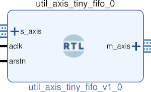

# UTIL AXIS TINY FIFO
## Simple single clock fifo
---

   author: Jay Convertino   
   
   date: 2021.06.02  
   
   details: Simple axis single clock pipeline fifo.  
   
   license: MIT   
   
---

### IP USAGE
#### INSTRUCTIONS

Pipeline method axis fifo. This fifo uses a pipeline to create a fifo. Meaning  
it has a latency the size of the depth. If the output receiving core is not ready  
the core will build up data till it is full. All data will have a latency of the depth.   

#### PARAMETERS
* depth : DEFAULT = 4 : Set the depth of the single clock fifo (number of words the size of width).
* width : DEFAULT = 8 : Set the data width of the fifo in bits.

### COMPONENTS
#### SRC

* util_axis_tiny_fifo.v
  
#### TB

* tb_fifo.v
  
### fusesoc

* Simulations are fixed at the moment.
